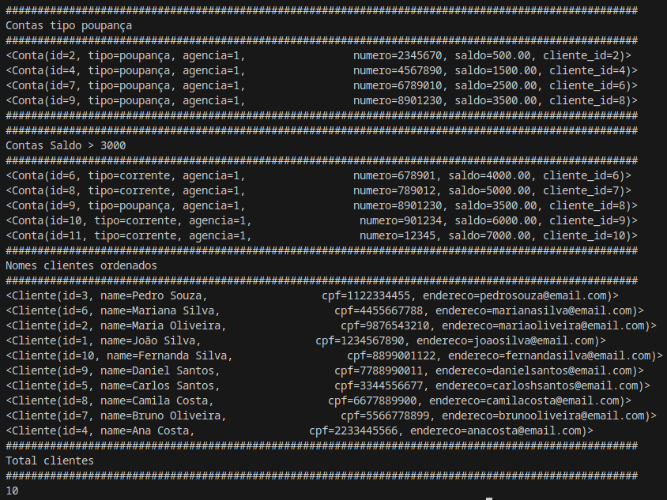
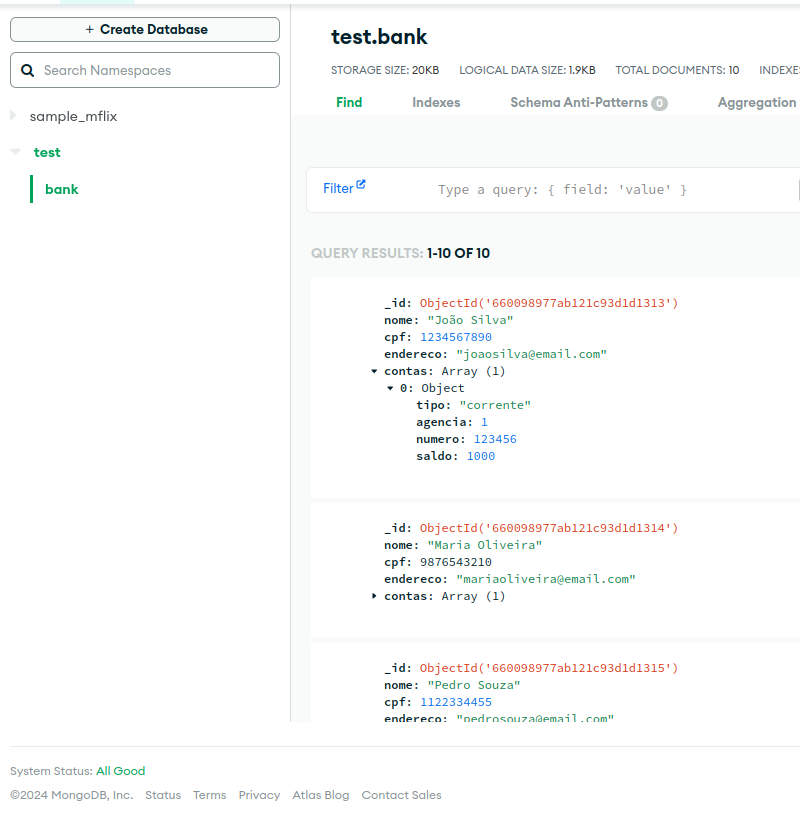
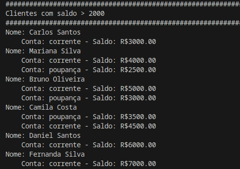
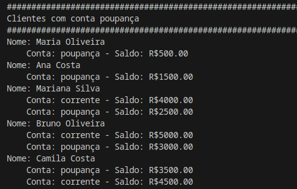

<h1>
    
    Formação Python Developer
</h1>

# :computer: Desafio de projeto: 

## Integrando Python com SQLite e MongoDB

### Parte 1 - Implementando um Banco de Dados Relacional com SQLAlchemy

Neste desafio você irá implementar uma aplicação de integração com SQLite com base em um esquema relacional disponibilizado. Sendo assim, utilize o esquema dentro do contexto de cliente e conta para criar as classes de sua API. Essas classes irão representar as tabelas do banco de dados relacional dentro da aplicação.

### Parte 2 – Implementando um Banco de Dados NoSQL com Pymongo

Você irá implementar um banco NoSQL com mongodb para fornecer uma visão agregada do modelo relacional. Sendo assim, as informações de cliente e contas existentes estão contidas dentro de documentos de acordo com cliente.

# :bulb: Solução do desafio

Os dados para popular o banco de dados foram gerados usando o google Gemini.

### Parte 1 - SQLAlchemy

A solução encontra-se no arquivo sqlAlchemyApp.py, tanto a persistência dos dados quanto as consultas. 

Exemplos de consultas:

### Parte 2 - Pymongo

Os dados são persistidos no banco de dados do MongoDB Atlas com o arquivo nosqlPymongoData.py

As consultas são feitas com o arquivo nosqlPymongoApp.py

Exemplos de consultas:

obs: Retirei minha uri do mongoDB Atlas dos arquivos
